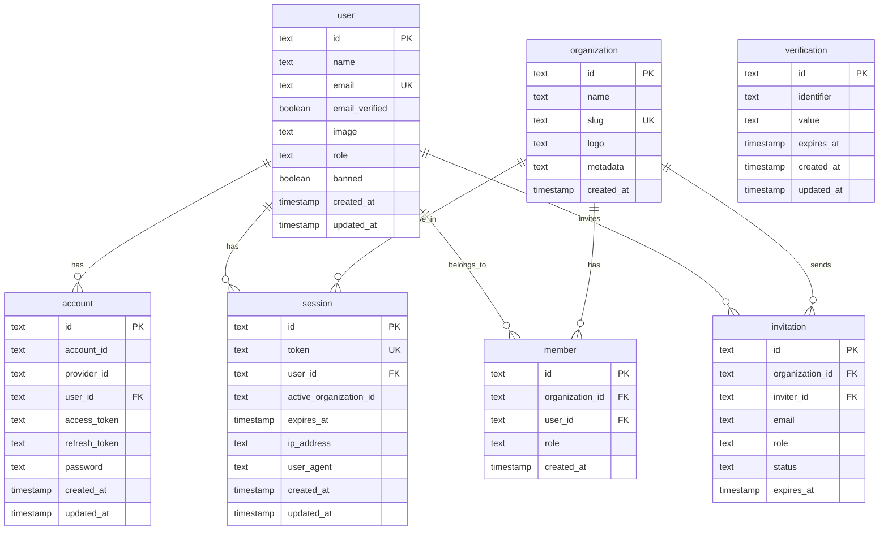

本文档详细说明了 Better Auth 认证系统中各个数据库表之间的关系，基于项目中的实际 Schema 定义和 Better Auth 官方文档。

## 1. 表结构概览

Better Auth 系统包含以下 7 个核心表：

| 表名 | 用途 | 记录数示例 |
|------|------|-----------|
| **user** | 用户基本信息表，存储用户的核心身份信息 | 2 |
| **account** | 账户认证信息表，存储 OAuth 提供商账户和密码凭证 | 3 |
| **session** | 会话表，管理用户的登录会话和活动状态 | 4 |
| **verification** | 验证令牌表，用于邮箱验证、密码重置等临时令牌 | 0 |
| **organization** | 组织表，多租户系统中的组织/团队信息 | 1 |
| **member** | 成员表，用户与组织的关联关系（多对多） | 2 |
| **invitation** | 邀请表，组织邀请用户加入的记录 | 0 |

## 2. ER 关系图



## 3. 详细关系说明

### 3.1 User（用户表）与其他表的关系

#### User → Account（一对多）
- **关系类型**：一个用户可以有多个账户
- **外键**：`account.user_id` → `user.id`
- **级联删除**：当用户被删除时，其所有账户记录会被自动删除（`onDelete: "cascade"`）
- **业务场景**：
  - 用户可以通过邮箱密码登录（创建一个 account 记录）
  - 用户可以通过 Google、GitHub 等 OAuth 提供商登录（每个提供商创建一个 account 记录）
  - 一个用户可以同时拥有多种登录方式

#### User → Session（一对多）
- **关系类型**：一个用户可以有多个活动会话
- **外键**：`session.user_id` → `user.id`
- **级联删除**：当用户被删除时，其所有会话会被自动删除
- **业务场景**：
  - 用户可以在多个设备上同时登录
  - 每个设备/浏览器会创建一个独立的会话
  - 会话包含 IP 地址、User-Agent 等信息用于安全追踪

#### User → Member（一对多）
- **关系类型**：一个用户可以属于多个组织
- **外键**：`member.user_id` → `user.id`
- **级联删除**：当用户被删除时，其所有成员关系会被自动删除
- **业务场景**：
  - 多租户系统中，用户可以加入多个组织
  - 每个成员关系都有独立的角色（role）权限
  - 通过 `member` 表实现用户与组织的多对多关系

#### User → Invitation（一对多，作为邀请人）
- **关系类型**：一个用户可以发送多个邀请
- **外键**：`invitation.inviter_id` → `user.id`
- **级联删除**：当邀请人被删除时，其发送的邀请会被自动删除
- **业务场景**：
  - 组织管理员可以邀请新用户加入组织
  - 邀请记录包含被邀请邮箱、角色、过期时间等信息
  - 邀请状态可以是 pending、accepted、rejected 等

### 3.2 Organization（组织表）与其他表的关系

#### Organization → Member（一对多）
- **关系类型**：一个组织可以有多个成员
- **外键**：`member.organization_id` → `organization.id`
- **级联删除**：当组织被删除时，其所有成员关系会被自动删除
- **业务场景**：
  - 组织是团队协作的基本单位
  - 每个成员在组织中有特定的角色（如 owner、admin、member）
  - 通过 `member` 表实现组织与用户的多对多关系

#### Organization → Invitation（一对多）
- **关系类型**：一个组织可以发送多个邀请
- **外键**：`invitation.organization_id` → `organization.id`
- **级联删除**：当组织被删除时，其所有邀请会被自动删除
- **业务场景**：
  - 组织管理员邀请新成员时创建邀请记录
  - 邀请包含目标邮箱、分配角色、过期时间等信息

#### Organization → Session（一对多，通过 activeOrganizationId）
- **关系类型**：一个组织可以有多个活跃会话
- **关联字段**：`session.active_organization_id` → `organization.id`
- **注意**：这不是外键约束，而是业务逻辑关联
- **业务场景**：
  - 用户可以在多个组织间切换
  - 每个会话记录当前激活的组织 ID
  - 用于实现多租户上下文切换

### 3.3 Verification（验证表）

- **独立性**：`verification` 表是独立的，不直接关联到 `user` 表
- **业务场景**：
  - 邮箱验证：用户注册时发送验证邮件，token 存储在 verification 表
  - 密码重置：用户忘记密码时生成重置 token
  - 通过 `identifier` 字段关联到用户邮箱或其他标识符
  - Token 有过期时间，过期后自动失效

## 4. 外键约束说明

### 4.1 级联删除规则

所有外键关系都配置了 `onDelete: "cascade"`，确保数据一致性：

| 子表 | 父表 | 级联行为 |
|------|------|---------|
| `account` | `user` | 删除用户时，自动删除该用户的所有账户 |
| `session` | `user` | 删除用户时，自动删除该用户的所有会话 |
| `member` | `user` | 删除用户时，自动删除该用户的所有成员关系 |
| `member` | `organization` | 删除组织时，自动删除该组织的所有成员关系 |
| `invitation` | `user` (inviter_id) | 删除邀请人时，自动删除其发送的所有邀请 |
| `invitation` | `organization` | 删除组织时，自动删除该组织的所有邀请 |

### 4.2 唯一约束

- `user.email`：邮箱唯一，确保每个邮箱只能注册一个账户
- `session.token`：会话 token 唯一，确保每个会话 token 不重复
- `organization.slug`：组织 slug 唯一，用于 URL 友好的组织标识

### 4.3 非外键关联

- `session.active_organization_id`：不是外键，而是业务逻辑字段，允许为空
  - 当用户未选择组织或组织被删除时，该字段可以为空
  - 这种设计避免了硬外键约束带来的删除复杂性

## 5. 实际应用场景

### 5.1 用户注册和登录流程

```typescript
// 1. 用户注册（邮箱密码方式）
// 创建 user 记录
// 创建 account 记录（providerId: "credential", password: hashed）

// 2. 用户通过 OAuth 登录（如 Google）
// 查找或创建 user 记录
// 创建 account 记录（providerId: "google", accountId: google_user_id）

// 3. 登录成功后
// 创建 session 记录
// 设置 session.active_organization_id（如果用户有组织）
```

### 5.2 多租户组织管理

基于项目中的 `packages/auth/src/config/plugins/organization.ts`：

```typescript
// 1. 创建组织（仅管理员可以创建）
// 创建 organization 记录
// 创建 member 记录（创建者自动成为成员）

// 2. 邀请用户加入组织
// 创建 invitation 记录
// invitation.inviter_id = 当前用户 ID
// invitation.organization_id = 目标组织 ID
// invitation.email = 被邀请用户邮箱

// 3. 用户接受邀请
// 查找 user（通过 invitation.email）
// 创建 member 记录
// 更新 invitation.status = "accepted"

// 4. 切换活跃组织
// 更新 session.active_organization_id
// 用于后续 API 请求的上下文判断
```

### 5.3 会话管理

```typescript
// 1. 多设备登录
// 用户在不同设备登录时，每个设备创建独立的 session
// session.user_id 相同，但 token 不同

// 2. 会话过期
// session.expires_at 控制会话有效期
// 过期后需要重新登录

// 3. 组织上下文
// session.active_organization_id 记录当前激活的组织
// API 请求基于此字段判断用户的操作上下文
```

### 5.4 邮箱验证流程

```typescript
// 1. 用户注册后发送验证邮件
// 创建 verification 记录
// verification.identifier = user.email
// verification.value = 随机 token
// verification.expiresAt = 24小时后

// 2. 用户点击验证链接
// 查找 verification 记录（通过 token）
// 验证是否过期
// 更新 user.emailVerified = true
// 删除 verification 记录
```

## 6. 数据完整性保证

### 6.1 必填字段

- **user**: `name`, `email`, `emailVerified`, `createdAt`, `updatedAt`
- **account**: `accountId`, `providerId`, `userId`, `createdAt`, `updatedAt`
- **session**: `expiresAt`, `token`, `userId`, `createdAt`, `updatedAt`
- **member**: `organizationId`, `userId`, `role`, `createdAt`
- **invitation**: `organizationId`, `email`, `status`, `expiresAt`, `inviterId`

### 6.2 默认值

- `user.emailVerified`: 默认为 `false`
- `user.banned`: 默认为 `false`
- `member.role`: 默认为 `"member"`
- `invitation.status`: 默认为 `"pending"`

### 6.3 时间戳自动更新

- `user.updatedAt`: 使用 `$onUpdate` 自动更新
- `account.updatedAt`: 使用 `$onUpdate` 自动更新
- `session.updatedAt`: 使用 `$onUpdate` 自动更新
- `verification.updatedAt`: 使用 `$onUpdate` 自动更新

## 7. 参考资源

- [Better Auth 官方文档](https://www.better-auth.com/docs/introduction)

