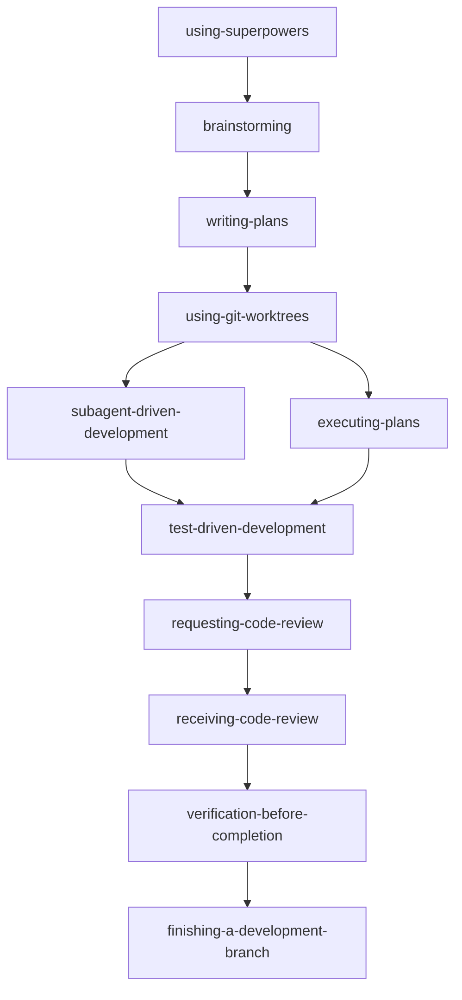
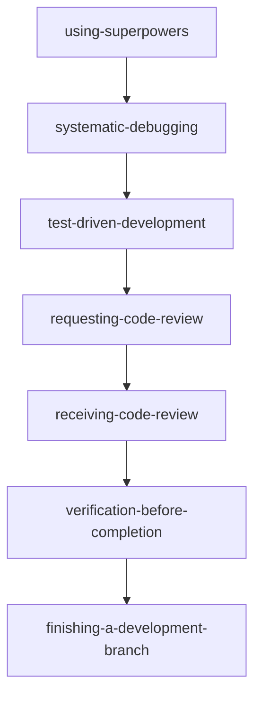
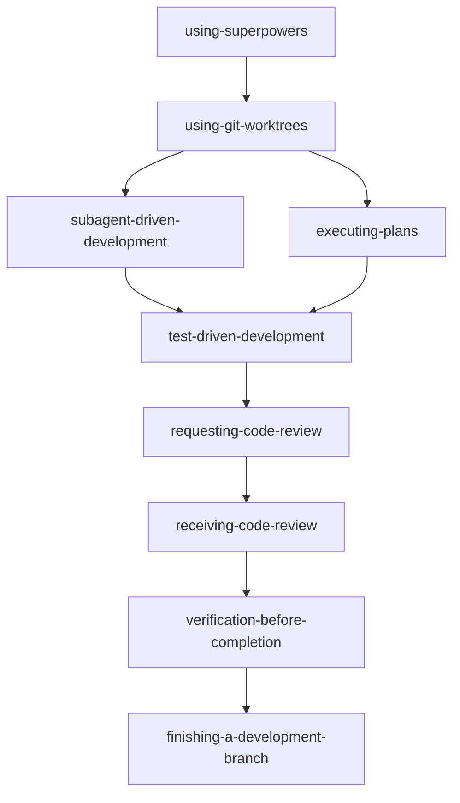
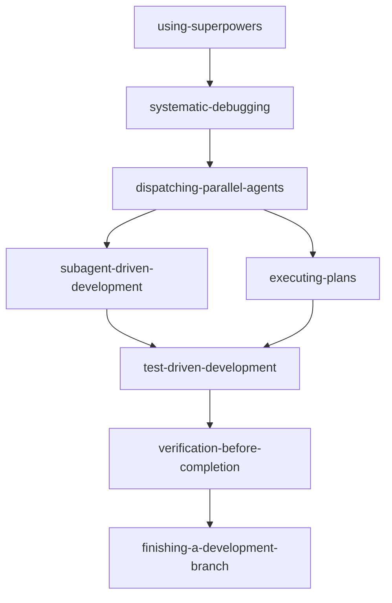

---
tags:
  - type/cheatsheet
  - topic/ai
  - topic/tools
---

[Superpowers](https://github.com/obra/superpowers) 是一个基于可组合“技能”（skills）的代理软件开发工作流框架，它通过一套初始指令确保 AI 代理在开发过程中遵循特定的方法论
。这些技能通常会自动触发，无需用户进行特殊操作

## superpowers 套件下的 skills（按场景分组，便于扫读

### 对话入口 / 选 skill
+ using-superpowers：对话一开始做 skill 判定与调用纪律（“有 1% 可能就先用 skill”）。
### 需求澄清 / 方案与规格
+ brainstorming：任何“要做/要改行为/要设计”的创意类工作，先把需求与设计说清楚再动手。
+ writing-plans：已有 spec/明确需求时，把实现拆成可执行的任务计划（含文件与验证方式）。
### 执行计划（实现）
+ subagent-driven-development：按计划分任务执行（适合任务相对独立、可分工/可复审）。
+ executing-plans：按计划手动推进执行（偏单线推进/无 subagent 能力时）。
### 调试与质量纪律
+ systematic-debugging：任何 bug/失败/异常行为，先定位根因再修。
+ test-driven-development：任何新功能/bugfix/重构/行为变更，先写失败测试再写实现。
+ verification-before-completion：准备说“好了/通过了/修复了/可以合并了”之前，必须先跑验证拿证据。
### Code Review（发起 / 接收）
+ requesting-code-review：需要让 reviewer 帮你找问题（里程碑/合并前/复杂改动后）。
+ receiving-code-review：收到 review 意见时，先核实与澄清，再逐条实现（必要时技术性反驳）。
### 分工并行
+ dispatching-parallel-agents：当有 2+ 个彼此独立的问题/任务，可并行分派加速。
### 分支收尾与集成
+ using-git-worktrees：开始较大改动/执行计划前，创建隔离工作区（worktree）。
+ finishing-a-development-branch：开发完成后，决定 merge/PR/保留/丢弃，并做收尾清理。

## 不同场景下的“使用流程”

### 场景一：新功能开发（从需求到合并）

### 线上 bug / 测试失败调试与修复

### 已有实现计划，需要执行（有/无子代理）

### 多个独立问题/子系统，需要并行处理

