```vid
https://www.youtube.com/watch?v=5999cgzA95A
Title: SOLID principles explained | Java |  System Design Interview
Author: ByteMonk
Thumbnail: https://i.ytimg.com/vi/5999cgzA95A/mqdefault.jpg
AuthorUrl: https://www.youtube.com/@ByteMonk
```

> [!info] TL;DW
> 本视频系统讲解了面向对象设计的 SOLID 五大原则，通过 Java 代码示例演示每个原则的正确与错误实践，帮助开发者写出更易维护、可扩展的代码。

---

## 🤖 AI 分析 (Processed by Cursor)

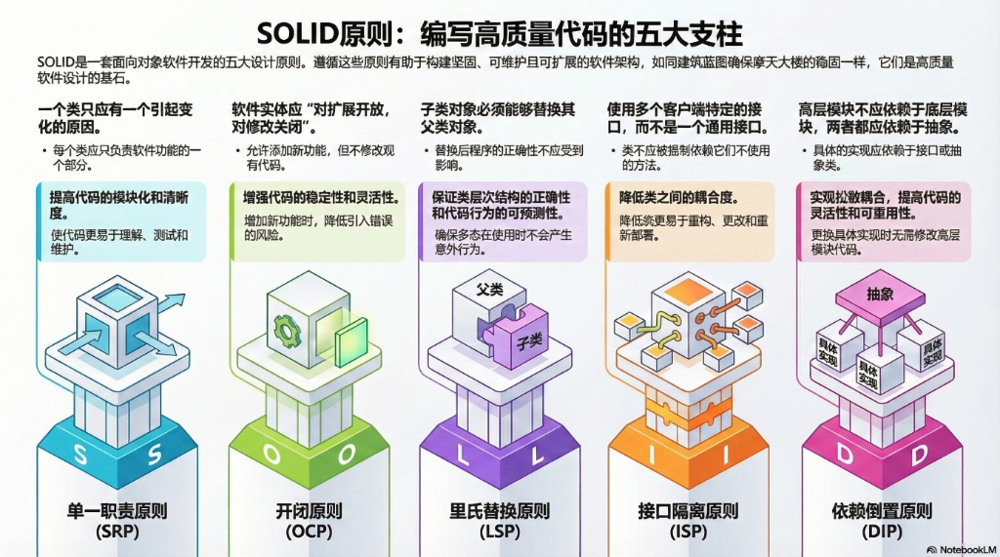

### 📋 Quick Reference

|  原则   | 英文全称                  | 核心思想        |
| :---: | :-------------------- | :---------- |
| **S** | Single Responsibility | 一个类只做一件事    |
| **O** | Open/Closed           | 对扩展开放，对修改关闭 |
| **L** | Liskov Substitution   | 子类可无缝替换父类   |
| **I** | Interface Segregation | 接口要小而专一     |
| **D** | Dependency Inversion  | 依赖抽象，不依赖具体  |

---

### 1. Summary (内容总结)

**SOLID** 是面向对象设计的五大核心原则，由 Robert C. Martin（Uncle Bob）提出，是编写可维护、可扩展、高质量代码的基石：

- **S**ingle Responsibility Principle (单一职责)
- **O**pen/Closed Principle (开闭原则)
- **L**iskov Substitution Principle (里氏替换)
- **I**nterface Segregation Principle (接口隔离)
- **D**ependency Inversion Principle (依赖倒置)

掌握这些原则对于系统设计面试和日常开发工作都至关重要。

---

### 2. Key Takeaway (内容要点)

#### S — Single Responsibility Principle (SRP)

> 💡 一个类应该只有一个引起它变化的原因

❌ Bad
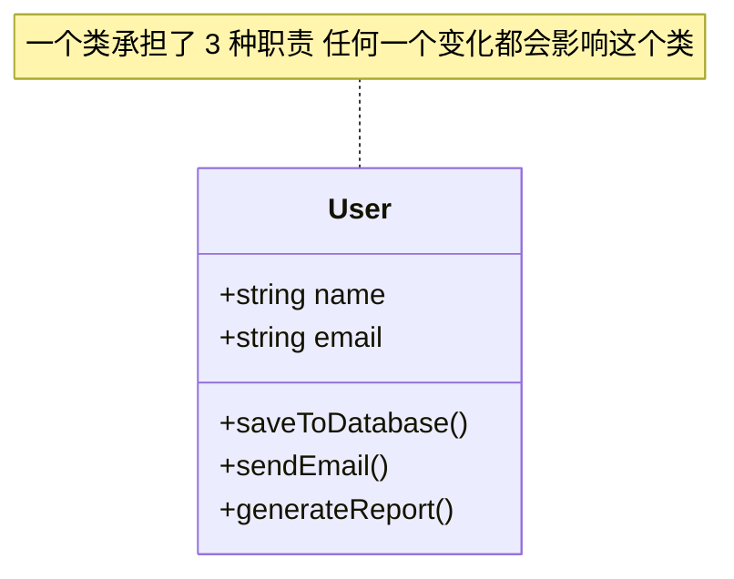
```typescript
class User {
  constructor(public name: string, public email: string) {}

  saveToDatabase() { /* 数据库操作 */ }
  sendEmail() { /* 发送邮件 */ }
  generateReport() { /* 生成报告 */ }
}
```

✅ Good
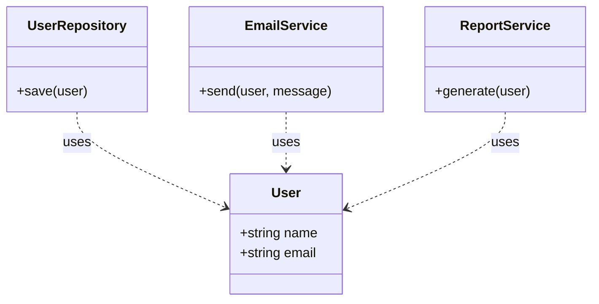

```typescript
class User {
  constructor(public name: string, public email: string) {}
}

class UserRepository {
  save(user: User) { /* 只负责数据库操作 */ }
}

class EmailService {
  send(user: User, message: string) { /* 只负责发送邮件 */ }
}
```

---

#### O — Open/Closed Principle (OCP)

> 💡 对扩展开放，对修改关闭

 ❌ Bad
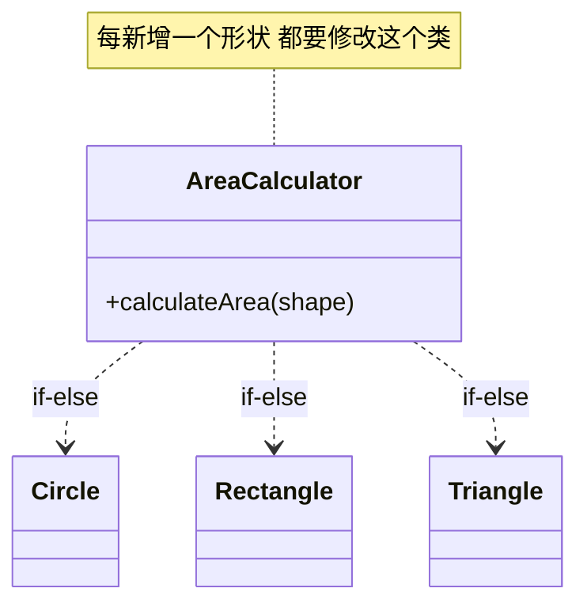

```typescript
class AreaCalculator {
  calculateArea(shape: any) {
    if (shape.type === 'circle') {
      return Math.PI * shape.radius ** 2;
    } else if (shape.type === 'rectangle') {
      return shape.width * shape.height;
    }
    // 新增形状需要修改这里...
  }
}
```

 ✅ Good
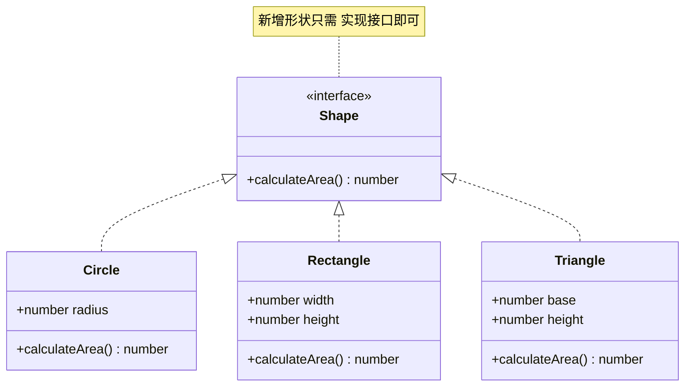

```typescript
interface Shape {
  calculateArea(): number;
}

class Circle implements Shape {
  constructor(public radius: number) {}
  calculateArea() { return Math.PI * this.radius ** 2; }
}

class Rectangle implements Shape {
  constructor(public width: number, public height: number) {}
  calculateArea() { return this.width * this.height; }
}

// 新增形状只需实现 Shape 接口
class Triangle implements Shape {
  constructor(public base: number, public height: number) {}
  calculateArea() { return 0.5 * this.base * this.height; }
}
```

---

#### L — Liskov Substitution Principle (LSP)

> 💡 子类必须能够完全替换其父类

 ❌ Bad
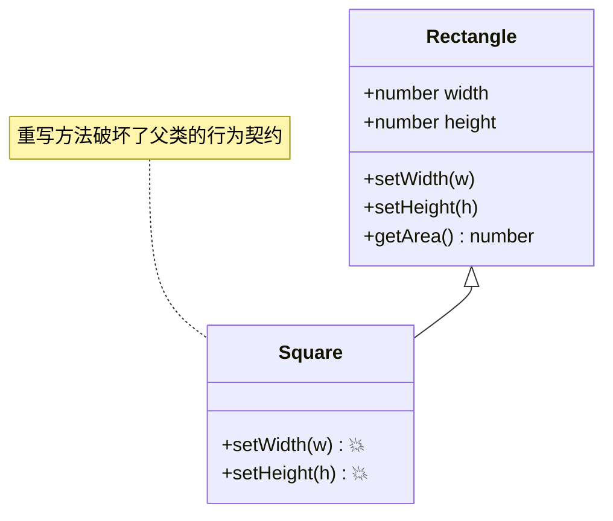

```typescript
class Rectangle {
  constructor(public width: number, public height: number) {}

  setWidth(w: number) { this.width = w; }
  setHeight(h: number) { this.height = h; }
  getArea() { return this.width * this.height; }
}

class Square extends Rectangle {
  setWidth(w: number) { this.width = this.height = w; }  // 💥 破坏父类行为
  setHeight(h: number) { this.width = this.height = h; }
}
```

✅ Good
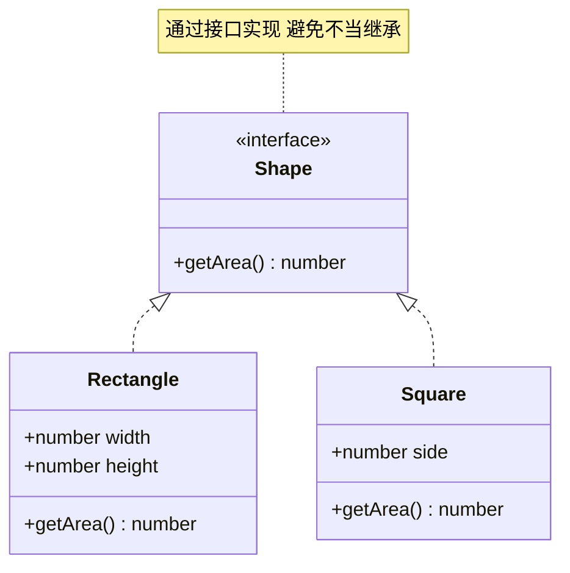

```typescript
interface Shape {
  getArea(): number;
}

class Rectangle implements Shape {
  constructor(public width: number, public height: number) {}
  getArea() { return this.width * this.height; }
}

class Square implements Shape {
  constructor(public side: number) {}
  getArea() { return this.side ** 2; }
}
```

---

#### I — Interface Segregation Principle (ISP)

> 💡 客户端不应被迫依赖它不使用的接口

❌ Bad
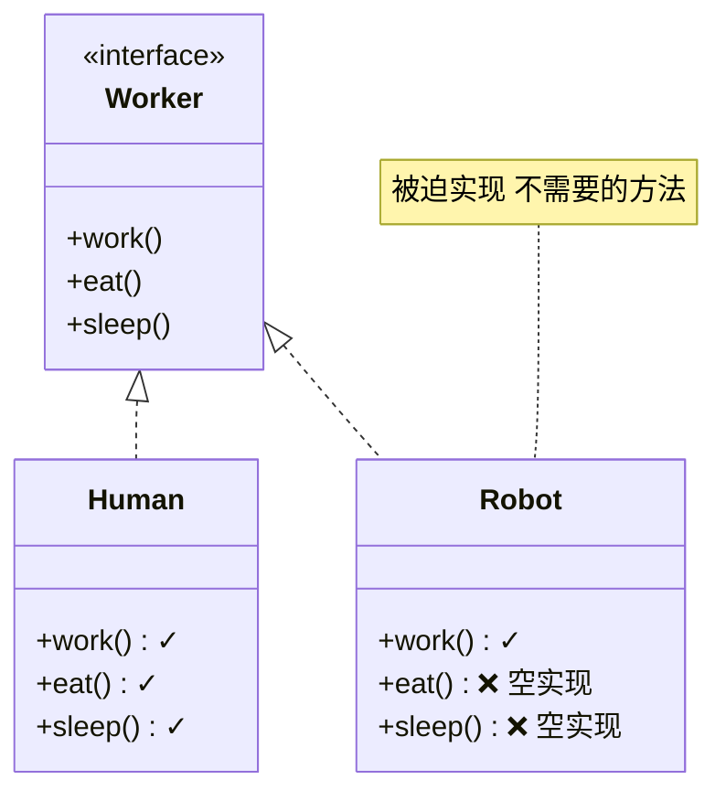

```typescript
interface Worker {
  work(): void;
  eat(): void;
  sleep(): void;
}

class Robot implements Worker {
  work() { console.log('Working...'); }
  eat() { /* 🤖 机器人不需要吃饭 */ }
  sleep() { /* 🤖 机器人不需要睡觉 */ }
}
```

✅ Good
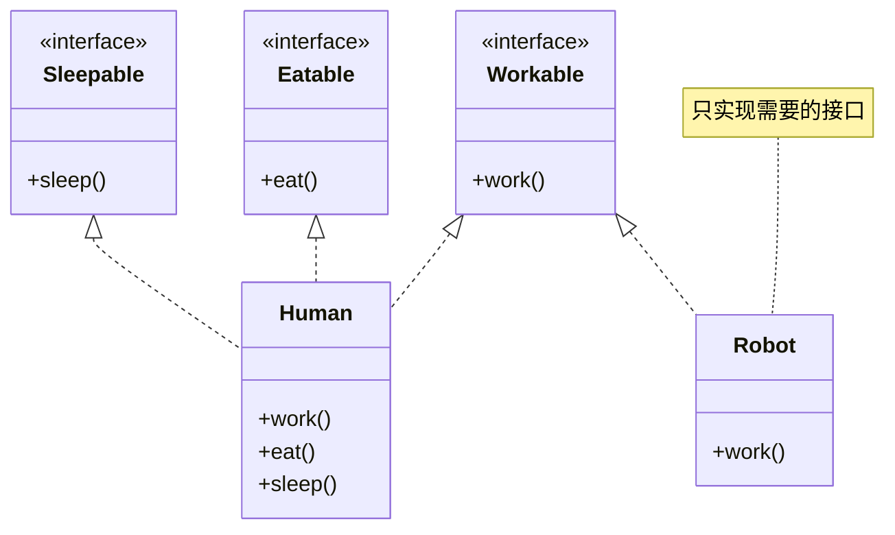

```typescript
interface Workable { work(): void; }
interface Eatable { eat(): void; }
interface Sleepable { sleep(): void; }

class Human implements Workable, Eatable, Sleepable {
  work() { console.log('Working...'); }
  eat() { console.log('Eating...'); }
  sleep() { console.log('Sleeping...'); }
}

class Robot implements Workable {
  work() { console.log('Working 24/7...'); }
}
```

---

#### D — Dependency Inversion Principle (DIP)

> 💡 高层模块不应依赖低层模块，两者都应依赖抽象

❌ Bad
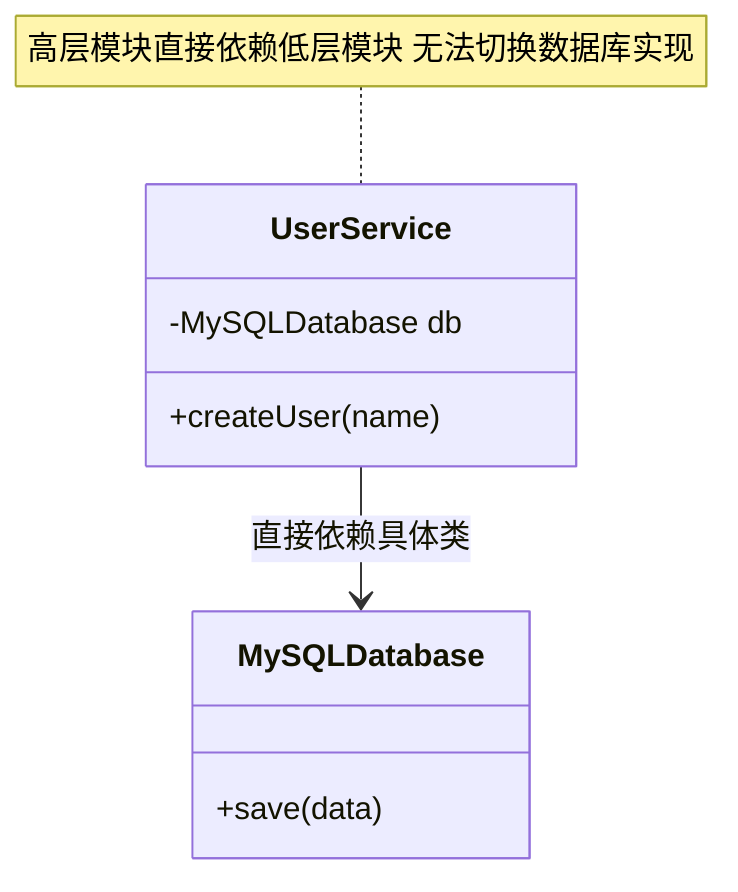

```typescript
class MySQLDatabase {
  save(data: string) { console.log(`Saving to MySQL: ${data}`); }
}

class UserService {
  private db = new MySQLDatabase();  // 💥 直接依赖具体实现

  createUser(name: string) {
    this.db.save(name);
  }
}
```

 ✅ Good
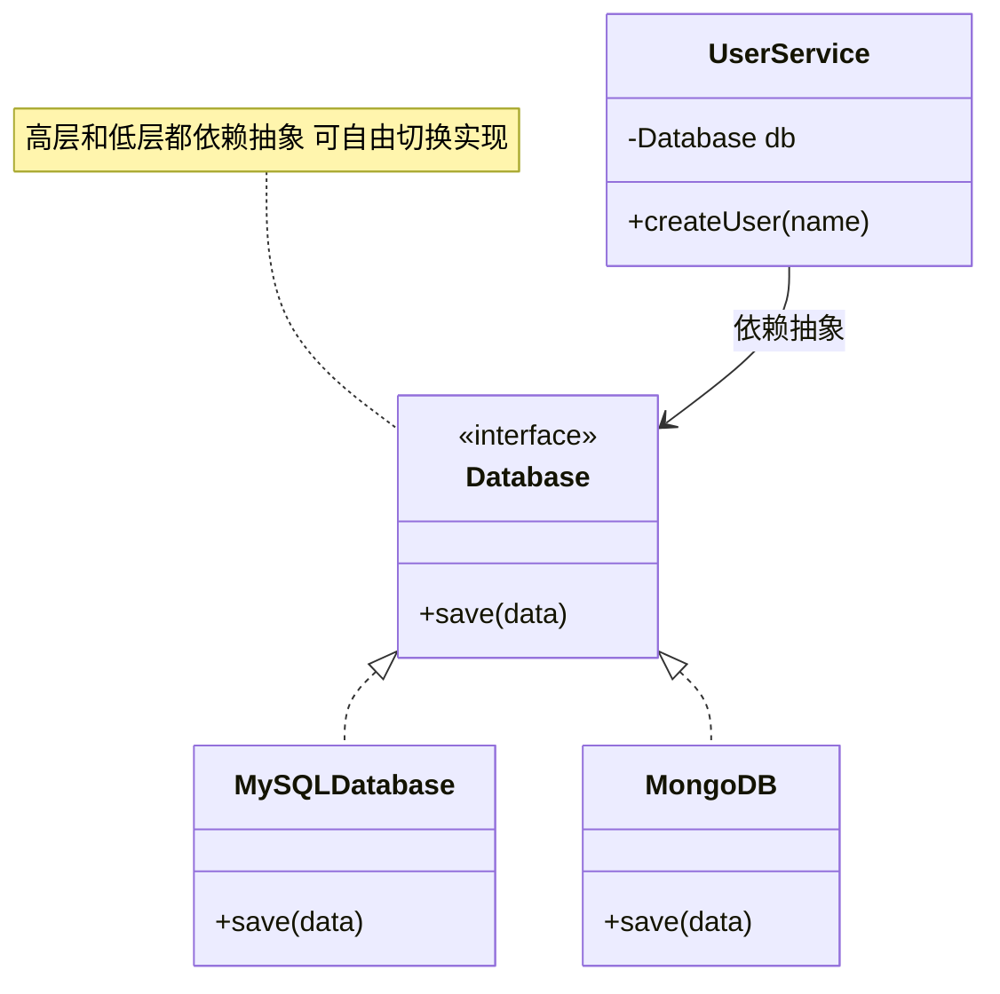

```typescript
interface Database {
  save(data: string): void;
}

class MySQLDatabase implements Database {
  save(data: string) { console.log(`Saving to MySQL: ${data}`); }
}

class MongoDB implements Database {
  save(data: string) { console.log(`Saving to MongoDB: ${data}`); }
}

class UserService {
  constructor(private db: Database) {}  // 依赖抽象

  createUser(name: string) {
    this.db.save(name);
  }
}

// 🎯 轻松切换数据库实现
const mysqlService = new UserService(new MySQLDatabase());
const mongoService = new UserService(new MongoDB());
```

---

### 3. Something New (值得关注的信息)

SOLID 原则在系统设计面试中的重要性常被低估。面试官通过 SOLID 问题不仅考察编码能力，更在评估**架构思维**和**代码演进意识**。

#### 🔗 SOLID 与设计模式的关系

| SOLID 原则 | 相关设计模式 |
|:---|:---|
| SRP | Facade, Proxy |
| OCP | Strategy, Decorator, Template Method |
| LSP | Factory Method, Abstract Factory |
| ISP | Adapter, Facade |
| DIP | Dependency Injection, Abstract Factory |

#### ⚠️ 避免过度设计

SOLID 应作为**指导原则**而非**教条**。在小型项目或原型开发中过度应用可能导致不必要的复杂性。关键是根据项目规模找到平衡点。

#### 🏗️ 与微服务架构的关联

| SOLID 原则 | 微服务对应 |
|:---|:---|
| SRP | 服务拆分 — 每个服务只做一件事 |
| OCP | 服务扩展 — 新增服务而非修改现有服务 |
| DIP | 契约优先 — 服务间通过接口/协议通信 |

---
