---
tags:
  - type/summary
  - source/video
  - topic/devops
source: https://www.youtube.com/watch?v=ObhdD49AEYw https://www.youtube.com/watch?v=T1nFYnonON8
---


## **Docker vs 虚拟机**

Docker 并不是虚拟机 (VM)。虚拟机是在物理机上运行一个完整的辅助操作系统，这非常笨重。Docker 的本质是在你的宿主机上运行一个**被隔离的进程**。

虚拟机 (VM) vs. Docker 容器 (Container)

| 特性       | 虚拟机 (VM)          | Docker 容器 (Container)              |
| -------- | ----------------- | ---------------------------------- |
| **内核使用** | 运行完整的辅助 OS，拥有独立内核 | **共享**宿主机的操作系统内核                   |
| **启动速度** | 分钟级（需加载整个 OS）     | **秒级**（仅启动一个受限进程）                  |
| **资源消耗** | 占用大量 CPU、内存和磁盘    | 极低，仅占用进程所需的资源                      |
| **底层技术** | 硬件虚拟化             | Linux **Namespaces** 与 **Cgroups** |

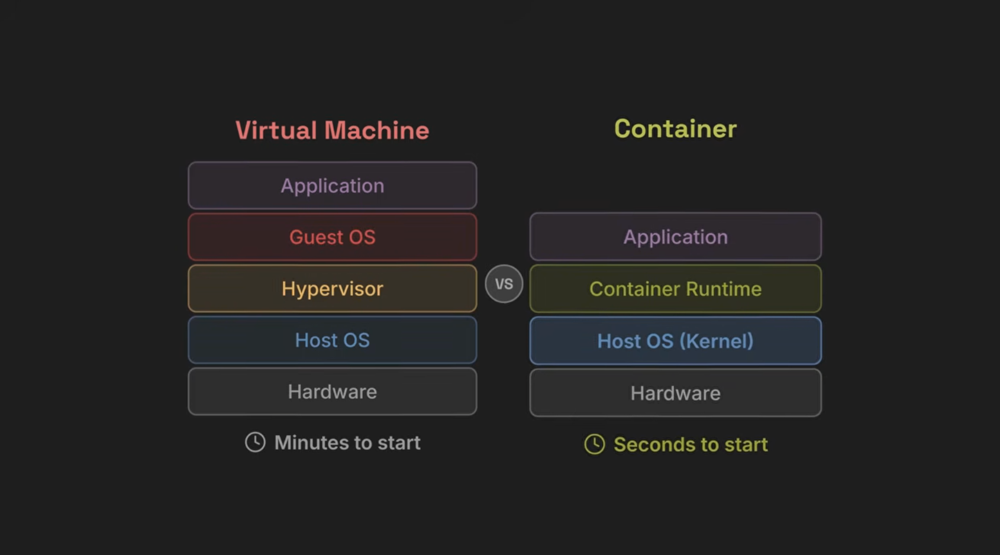

**底层逻辑：如何为进程“筑墙”？**

- **Namespaces（命名空间）：** 为进程提供隔离的视图。它让进程以为自己拥有独立的网络接口、进程树（PID）和文件系统根目录。
- **Cgroups（控制组）：** 为进程设置资源上限，限制 CPU 和内存使用。

 既然容器依赖 Linux 内核，为什么在 Mac 或 Windows 上也能运行？其实，当你安装 Docker Desktop 时，它在后台静悄悄地运行了一个**轻量级的 Linux 虚拟机**。

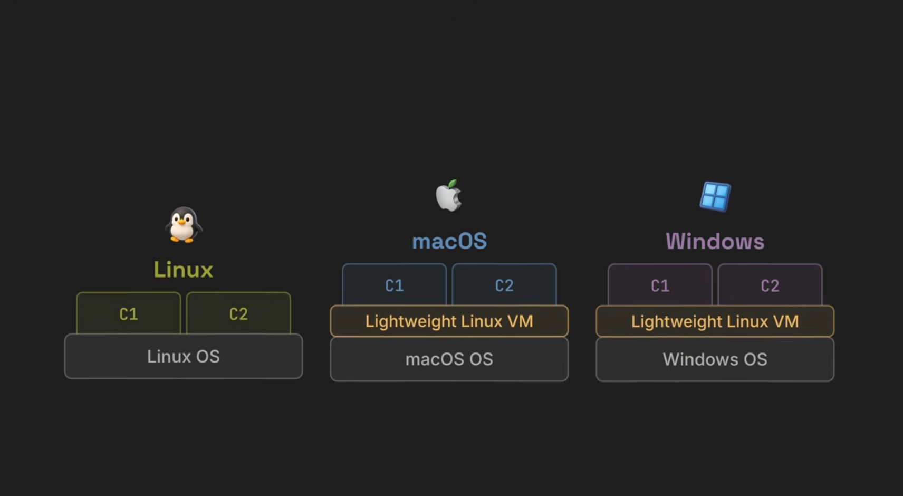

你的容器实际上运行在这个虚拟机提供的内核之上，这就是为什么 Docker 在 Linux 原生环境下的性能表现通常更好的原因。


## **Image vs Container**
镜像 (Image) 是“蓝图”，容器（Container）是基于蓝图生成实例。

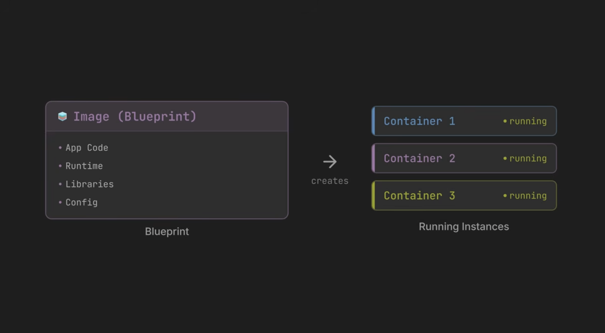

镜像包含了程序运行所需要的一切。包括 *代码*，*运行时*，*系统库*，*环境变量*，*配置文件*, 它是一个完整的独立包，但是并没有运行，它只是放在磁盘上的一个文件。

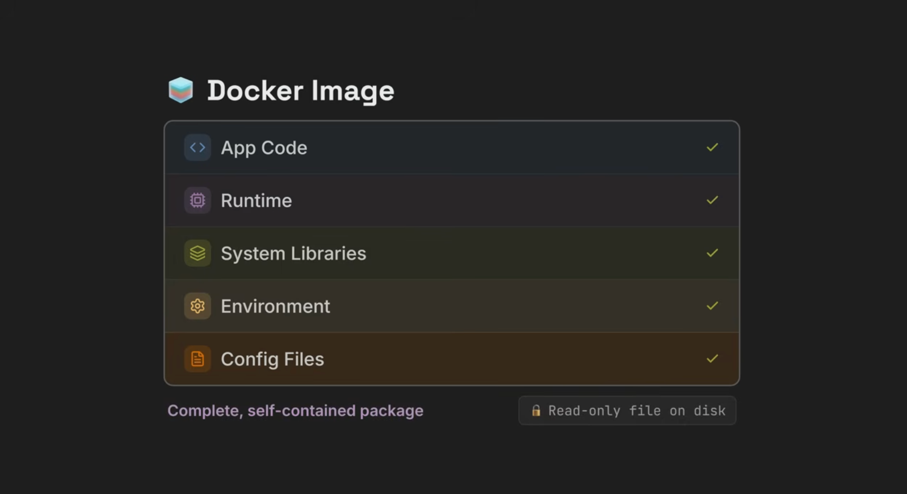

当你运行 `docker run 镜像名` Docker使用这个镜像创建一个隔离的环境，并在其中开启一个`process`, 这个进程就是容器。

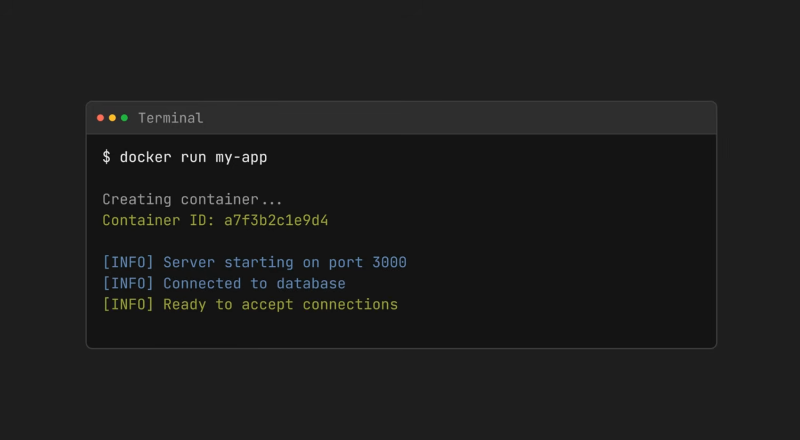

你可以使用同一个镜像创建任意多的容器，就像你可以通过类创建任意多的对象一样。容器之间是隔离的，它们有自己的**可写层**，**进程空间**，**网络**

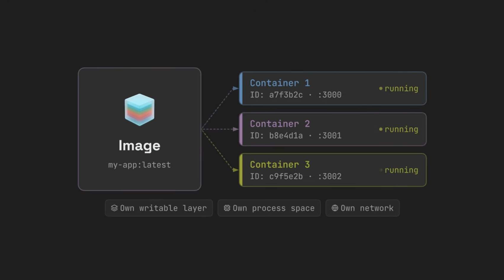

因为这些容器由同一个镜像创建而来，因此它们具有一致性，如果团队中的成员都拉取的是同一个镜像并通过 `docker run`创建容器，那么大家会得到一个相同的环境。

**它在我的环境上能运行啊！** 的问题就不会出现了。

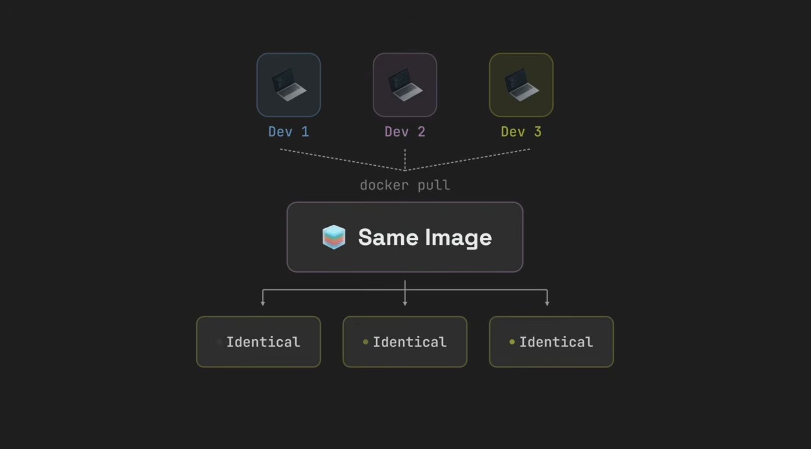


## **Dockerfile**

Docker 镜像并非一个单一的大文件，而是由多个**层（Layers）叠加而成的只读文件系统。这种结构不仅提高了存储效率，更是构建加速的基础。

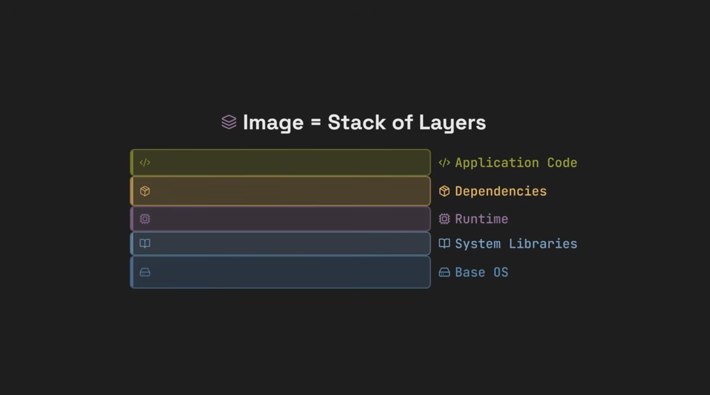

### **“层”的来源与隔离机制**

镜像是 `Dockerfile` 构建而来，下面是一个典型的`Node.js`项目的`Dockerfile`:
```sh
# 作为构建的基础，它定义了镜像的父层。例如使用 node:20-alpine 可以获得一个基于超轻量级 Alpine Linux 的 Node.js 20 环境
FROM node:20-alpine

# 该指令为后续的指令设定工作目录。如果目录不存在，Docker 会自动创建。
WORKDIR /app

# 将宿主机的文件系统内容复制到镜像中。
COPY package.json .

# 在构建镜像的过程中执行命令，例如 npm install。每一个 RUN 指令都会产生一个新的只读层
RUN npm instaLl

# 将项目代码复制到镜像中
COPY • •

# 定义了容器启动时的默认行为，例如：执行 node server.js
CMD ［"node","server.js"］
```

当 `docker run Dockerfile` 时，**修改文件系统的指令**都会创建新的**层**，像`RUN`、`COPY`、`ADD`。像 `CMD`、`ENV`、`EXPOSE`等只会添加元数据，不会修改文件系统，所以不会创建层。

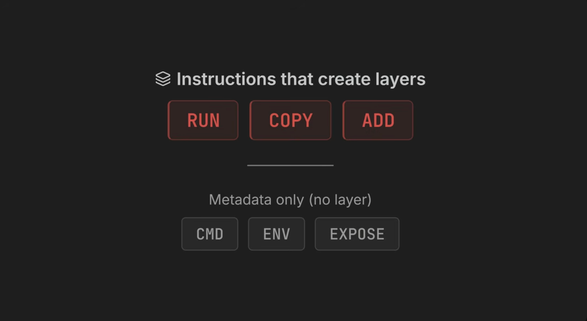

上述`Dockerfile`运行后，会生成如图所示的镜像

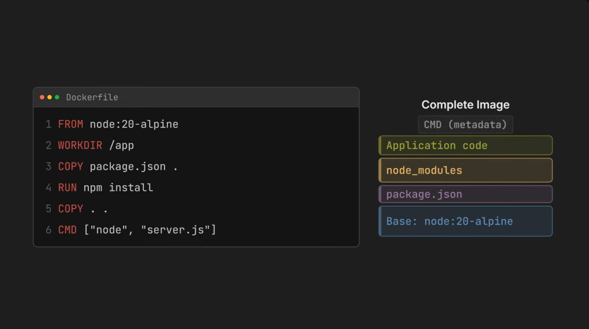


### **层级缓存**

Docker 的层级缓存（Layer Caching）是提升构建效率的核武器。

>缓存匹配逻辑

当你执行 `docker build` 时，Docker 会按顺序对比 Dockerfile 指令。如果当前指令与之前构建时的指令完全一致，且其依赖的所有前序层均命中缓存，Docker 就会直接复用已有的层，而不再执行实际计算（显示为 `USING CACHE`）。

>“缓存失效”的连锁反应

必须警惕的是，缓存遵循“多米诺骨牌效应”：**一旦某一层因为文件内容改变或指令修改导致缓存失效，该层之后的所有指令都必须重新执行。**

**“缓存的一致性取决于指令的内容及其顺序。”**

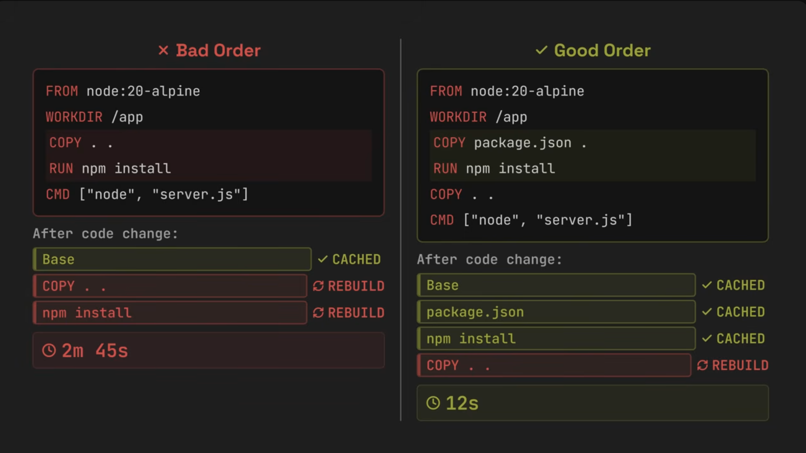


为了最大化利用这种“记忆力”，我们应该如何调整编写 Dockerfile 的逻辑？

==**把改动较少或者不改动的指令，放到 Dockerfile 的上面**==


## **数据持久化: 数据卷 (Volumes) 与 绑定挂载 (Bind Mounts)**

之前提到**容器就是一个进程**，当进程被杀死后，容器内的数据就消失了。

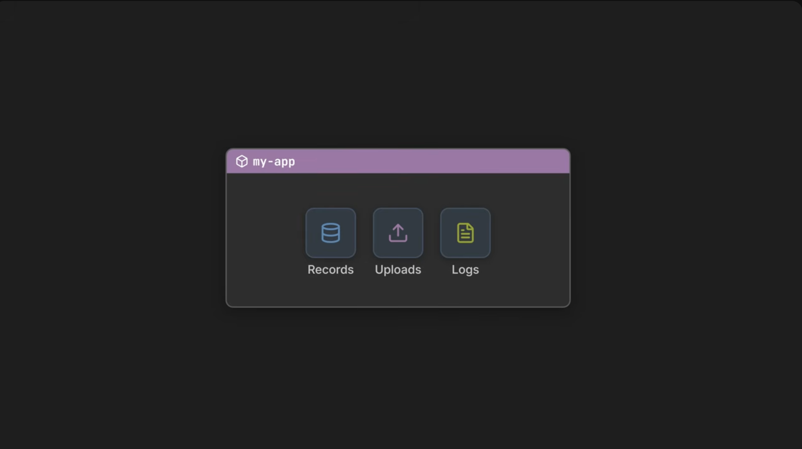

但对于数据库等状态化应用而言，数据的持久化是不可逾越的鸿沟。Docker 提供了两种主要机制来解决这一矛盾：**数据卷（Volumes）** 和 **绑定挂载（Bind Mounts）**

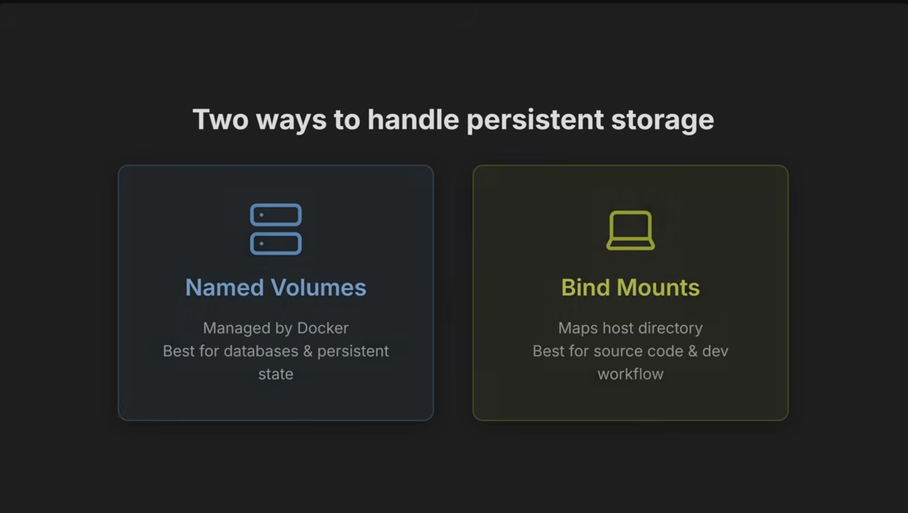

### **数据卷 (Named Volumes)**

数据卷由 Docker 引擎直接管理，其在宿主机上的具体存储路径对用户透明（通常位于 `/var/lib/docker/volumes/`）。它由Docker CLI 直接管理，即使容器被移除，它依然存在。


这是在生产环境中持久化数据库（如 PostgreSQL）数据的首选方案，因为它具备更好的移植性、更安全的隔离性，并且可以通过 。

### **绑定挂载 (Bind Mounts)**

绑定挂载则是将宿主机上的绝对路径直接映射到容器内部。这种方式在开发阶段具有无可比拟的优势：开发者可以将源代码目录（如 ./src）挂载到容器的 /app/src，从而实现“即时生效”的开发模式，无需在每次代码修改后重新构建镜像。

### **存储机制对比分析**

| 特性 | 数据卷 (Volumes) | 绑定挂载 (Bind Mounts) |
| :---- | :---- | :---- |
| **管理主体** | Docker 引擎自动管理 | 用户手动指定宿主机路径 |
| **宿主机依赖** | 极低，路径抽象化 | 极高，需确保路径存在 |
| **性能** | 在不同 OS 上表现稳定 | 依赖宿主机文件系统性能 |
| **典型应用场景** | 生产数据库、持久化日志 | 本地代码热重载、配置文件共享 |
| **命令示例** | db-data:/var/lib/postgresql/data | ./src:/app/src |

通过合理组合这两种机制，开发者可以在保持容器轻量化的同时，灵活地管理应用的状态数据。

## **第五章 网络通信与服务发现**

容器之间是隔离的，这就带来了两个问题
1. 宿主机如何与容器通信?
2. 容器之间如何通信?

### **端口映射机制**

由于容器运行在独立的网络命名空间内，外部流量无法直接到达容器。端口映射（Port Mapping）通过 `-p` 标志建立宿主机与容器之间的隧道。例如，`-p 8080:3000` 意味着宿主机的 `8080` 端口将监听请求并将其转发至容器内部的 `3000` 端口。

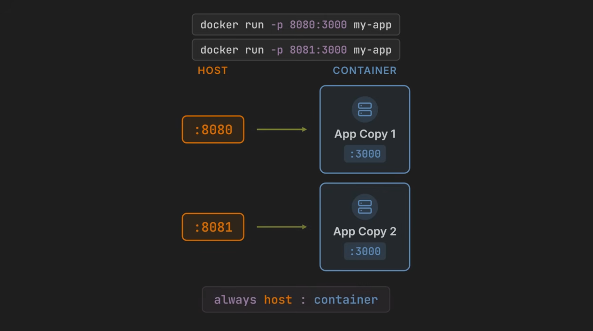

### **自定义网络与内置 DNS**
Docker安装后，它会出创建一个名为 `bridge`的默认网络。你运行的任何容器都会连接到这个网络上。
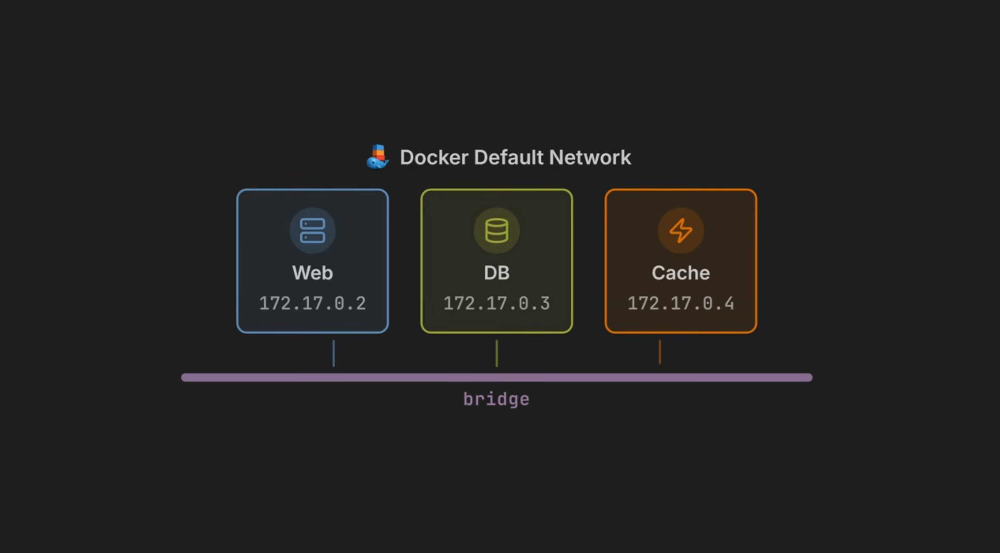

在默认的 `bridge` 网络上的容器只可以通过 `IP` 相互通信。在多容器应用中，硬编码 IP 地址是极其危险的。因为每次重启容器，容器的 IP 可能会发生变化。

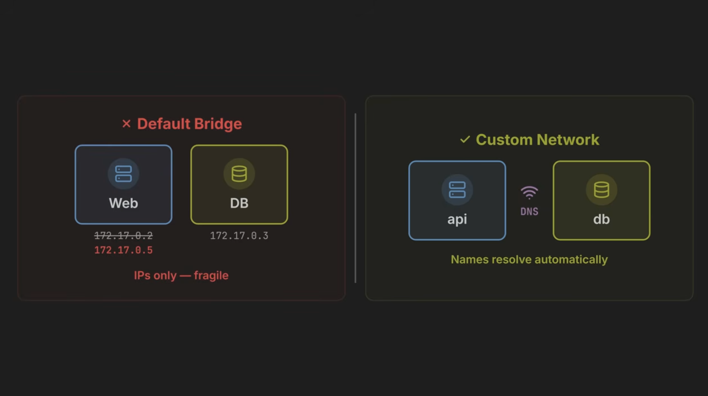

Docker 允许创建自定义网络，在该网络内，Docker 提供了内置的 DNS 服务。这意味着容器可以通过服务名称（Service Name）相互发现。

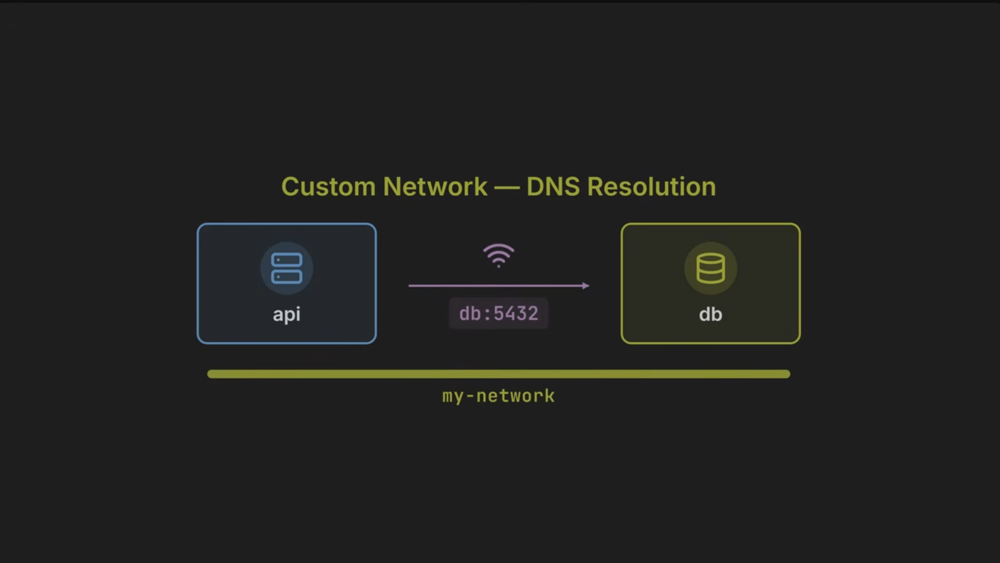

例如，一个 `API` 容器可以通过主机名 `db` 连接到 PostgreSQL 容器，而无需关心 db 容器的实际内网 IP 是多少。

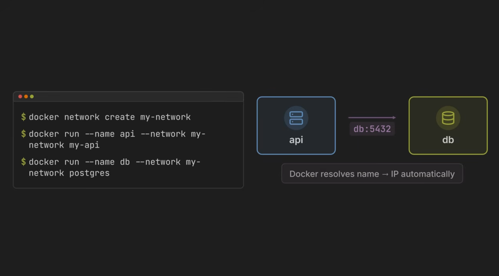

这种基于服务名称的抽象，为微服务架构中的横向扩展（Scaling）奠定了坚实的基础，使得容器在重新启动或漂移后仍能保持稳定的连接逻辑。

>❓你是否曾经好奇 Docker Compose 时，`services`之间是如何通过名称相互定位的？

其实 Docker Compose 会在幕后创建了一个自定义的网络来统一编排所有 service，我们会在下一节介绍这一点。

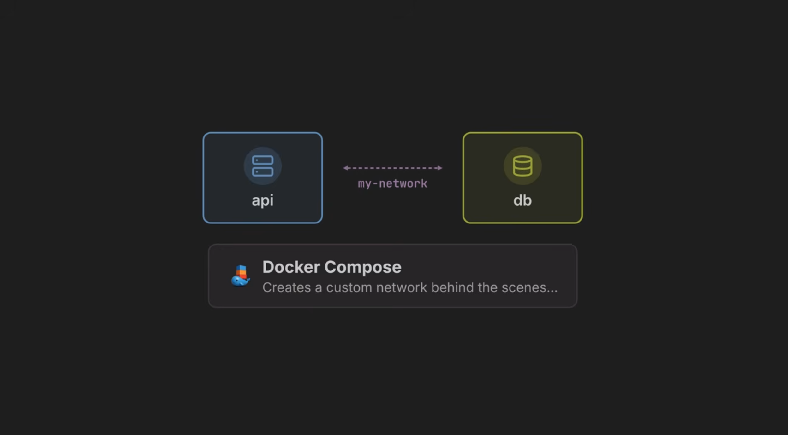


## **第六章 Docker Compose：复杂协议的编排艺术**

随着应用复杂度的提升，手动管理数十个容器的启动顺序、环境变量和网络配置变得不再可行。Docker Compose 应运而生，它通过单一的 YAML 文件定义了整个应用栈的期望状态 。

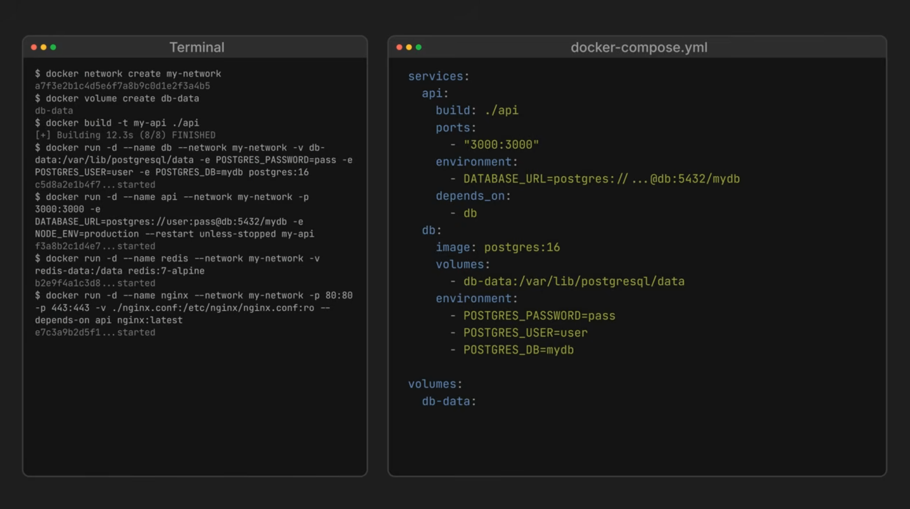

在 YAML 结构中，不仅定义了容器的构建方式，还详细描述了服务间的依赖关系：

* **services**：定义了独立的微服务单元，其实就是容器
	* api：容器名
		* **build: ./api**：指示 Docker 实时根据 `./api`目录下的 Dockerfile 构建镜像。
		* **depends\_on**：控制启动顺序。
	* db： 容器名
		* **image: postgres:16**: 指示 Docker 使用官方的 postgres:16 镜像启动容器。
		* **volumes**: 指示通过 db-data 这个 命名 Volumne 来保持数据持久
* **volumes**: 定义命名 volume, 由 Docker 来管理
	* db-data: volume 的名字

这样就可以通过命令来编排多个容器了：

| 命令                          | 执行效果           | 应用场景      |
| :-------------------------- | :------------- | :-------- |
| **docker compose up \-d**   | 后台启动所有服务       | 部署生产或开发环境 |
| **docker compose logs \-f** | 实时查看所有服务日志     | 调试多容器交互故障 |
| **docker compose stop**     | 停止运行中的容器，保留状态  | 临时暂停服务    |
| **docker compose down**     | 停止并移除容器、网络及匿名卷 | 彻底清理环境    |
| **docker compose ps**       | 显示当前项目下的服务状态   | 监控服务健康度   |


当运行 **docker compose up** 后 Docker Compose 会自动创建一个自定义网络，这个网络内的容器就可以通过容器名来通信了。

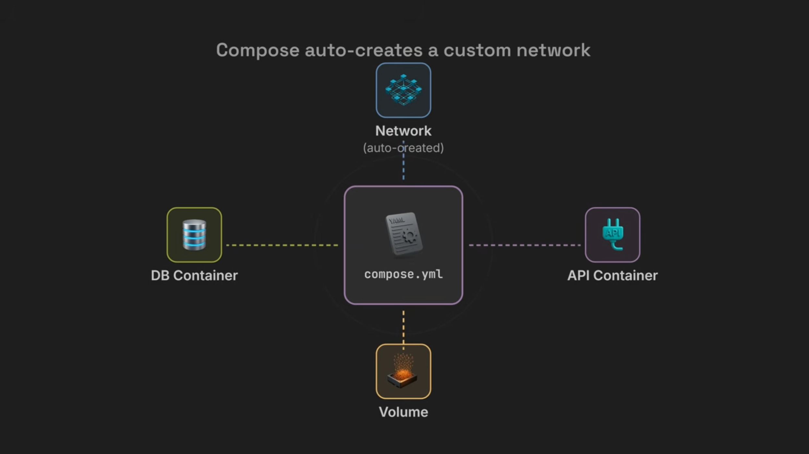


关于 Docker Compose， 有一点我们需要了解，它并不是什么新事物，它只是把
+ docker build
+ docker run
+ docker network create
+ docker volume create
+ ...
这些原本需要你手动敲的命令统一转换到了 YML 文件中的声明式命令了。

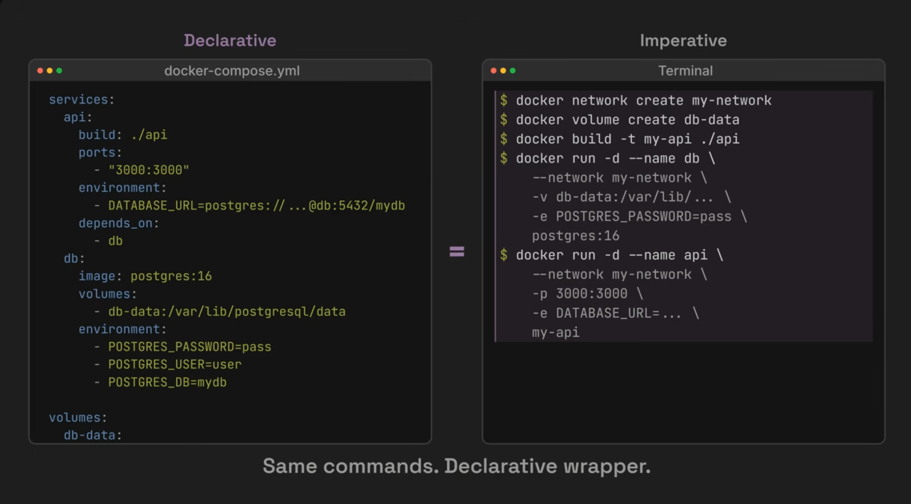

## **总结**

 纵观整篇文章，我们看到 Docker 并不是一套需要死记硬背的枯燥命令，它背后是有一个需要了解的完整系统的。
 1. 为什么容器修改不了任何文件？因为它是镜像的实例，它只在镜像的层级之上加了一个 可写层。
 2. 因为容器是进程，所以容器被移除后，可写层的数据就丢失了，因此需要做数据持久化
 3. 为什么构建镜像有时候很慢？因为有时候层级缓存失效了。Dockerfile 中的指令决定了哪些层会被缓存
 4. 为什么你的容器找不到彼此，因为默认 `bridge`网络找不到彼此，需要创建自定义网络
 5. 多容器的管理很不方便，便有了 Docker Compose

它们是一个连贯的模型

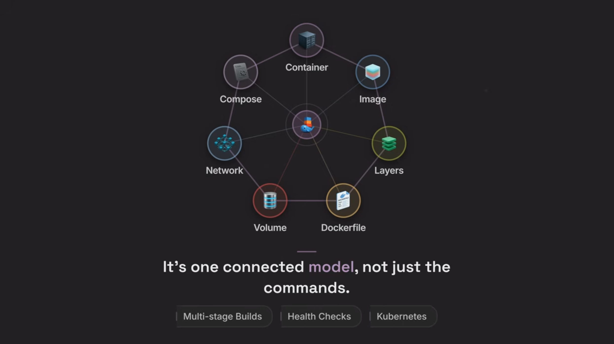
