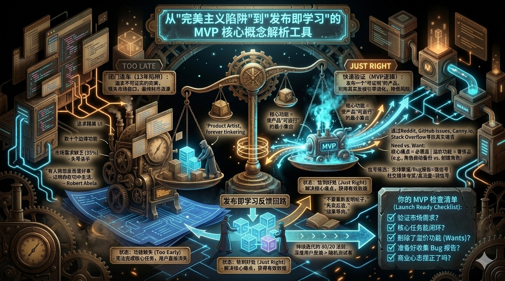

---
tags:
  - type/concept
  - topic/product-management
  - topic/career
---

# MVP（最小可行产品）

## 定义

MVP（Minimum Viable Product）是指能够**解决用户核心痛点、形成价值闭环**的最小产品形态；既不是功能残缺的“半成品”，也不是在未经验证前就过度打磨的“完美品”。目标是尽早发布、用真实反馈驱动迭代，从而验证市场需求并降低失败成本。

## 核心要点

- **恰到好处**：具备完成核心任务所需的最小功能集合，用户能跑通主流程并给出有效反馈。
- **发布就绪三态**：功能缺失（Too Early）导致反馈缺失；恰到好处（Just Right）获得有效数据；过度打磨（Too Late）带来巨大沉没成本。
- **Needs vs Wants**：核心功能 = 使产品“可运行”的最小集合；不直接解决核心痛苦的功能是溢价功能（Wants），应移至后期。
- **发布即学习**：MVP 是开启用户反馈回路的钥匙；发布是为了学习与验证，而不是展示完美。
- **先卖后造**：在投入大量精力前，先确认需求与付费意愿，甚至可先推出早期访问定价。

## 应用场景

- 创业或从 0 做新产品时：用 MVP 快速验证“是否有人需要”，避免闭门造车。
- 规划首版功能时：只保留核心任务闭环，把“自动备份”“自动化工作流”等 Wants 排到后续版本。
- 收到大量用户反馈时：用 80/20 法则和“是否符合核心价值”等过滤器做优先级，避免功能膨胀。

## 相关概念

- [[距离与位移]]（结果导向：客户只关心从 A 到 B 的结果，不关心实现路径）

## 来源

- [[📝-How to Build a Minimum Viable Product (MVP)]]
