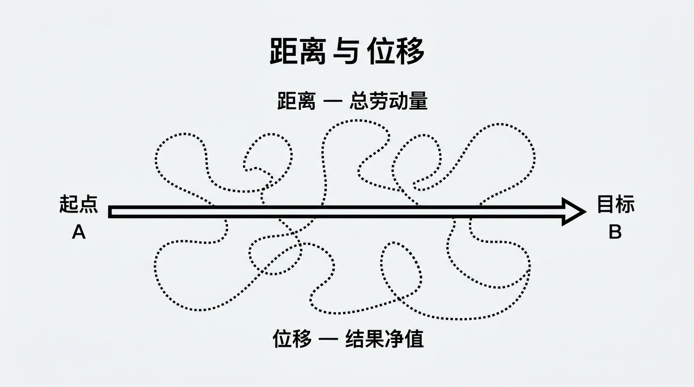

---
tags:
  - type/concept
  - topic/productivity
---

# 距离与位移

## 定义

用物理学隐喻区分「努力总量」与「有效结果」：
1. **距离**指你付出的所有劳动总量（可能包含很多无用功）；
2. **位移**指从起点 A 到目标 B 的直线净值。

世界只关心你的结果（位移），而不关心你走得有多累；因此要寻找到达目标的最短直线路径。

## 核心要点

- 距离 = 总劳动量，可能包含大量无效或低效动作。
- 位移 = 从起点到目标的净值，即实际达成的结果。
- 评价标准是结果（位移），不是辛苦程度（距离）。
- 应优先优化路径，用最少的「位移」达成目标，而非堆砌「距离」。

## 应用场景

- 设定目标与衡量成效时：问「离目标近了多远」而非「做了多少事」。
- 做时间与任务取舍时：优先做能直接推进结果的高 ROI 任务，减少无效忙碌。
- 复盘与改进时：识别哪些是「距离」、哪些是「位移」，削减前者、强化后者。

## 相关概念

- （可后续与目标设定、效率、收入驱动任务前置等笔记链接）

## 来源

- [[📺-7 No BS Ways to Become More Productive in 2025 (+$129Kmo)]]
