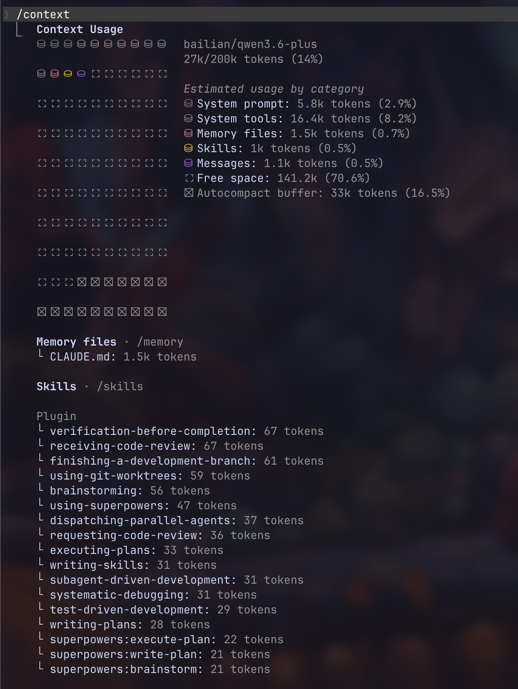

---
tags:
  - type/concept
  - topic/ai
  - source/article
  - status/done
created: 2026-04-12
updated: 2026-04-12
sources: 0
---

# AI 上下文

## 定义

**一句话：** **上下文（Context）**是 AI 助手本轮能**实际看见并纳入推理**的信息集合——包括对话历史、你挂载的文件、工具返回的结果；它**不等于**模型的全部知识，且**受限于窗口长度与产品实现**。

**比喻：** 像**摄影师的镜头取景框**：框外风景再多，此刻也拍不进去；你得把想拍的主体**移进框内**（`@` 文件、粘贴代码、调用工具拉取），且框子大小有限——装不下时就得**取舍或拼全景**。

> **对应关系：**「取景框」对应**上下文窗口（Context Window）**；「移进框内」对应**显式注入**（@mention、附件、MCP 工具结果）；「拼全景」对应**摘要、索引与 RAG**；框子边界对应**模型 token 上限与计费单元**。

## 核心要点

- **可见即可用，不见即不用**：无论训练知识多丰富，本轮只能对齐窗口内的文本。Cursor 与 Claude Code 均通过索引、摘要、优先级算法决定「把什么塞进框」。
- **组成来源**：
  - 系统提示（System Prompt / Rules）——人设与指令
  - 对话历史——多轮 user/assistant 消息
  - 显式挂载——`@` 文件、文件夹、代码符号
  - 工具返回——MCP、检索、命令输出、Web 搜索结果
- **窗口限制与策略**：模型有最大 token 上限；产品常采用**滑动窗口**（ oldest 丢弃）、**摘要压缩**、** relevance 排序**等策略，而非简单截断。
- **成本与延迟**：上下文越长，推理耗时与计费通常越高；无关内容会**稀释注意力**，故需要筛选（如 Cursor 的代码索引、Claude 的 context7 优先级）。

## 在 Cursor/Claude Code 中的体现

| 产品 | 上下文管理方式 | 关键机制 |
|------|---------------|----------|
| **Cursor** | `@` 符号挂载文件、文件夹、代码符号；自动索引项目 | 智能索引决定哪些代码进入上下文；技能（Skills）按需加载片段 |
| **Claude Code** | 读取整个代码库理解；多文件编辑；MCP 连接外部数据 | 代码库级上下文感知；通过 MCP 把 Google Drive、Jira 等外部信息拉进对话 |

## 应用场景

- 在 IDE 中使用 `@` 精确控制「此刻镜头对准哪里」，避免无关文件稀释。
- 设计 Agent 时权衡：全库索引（如 Claude Code）vs 按需检索（如 Cursor 的上下文控制），在**完整性**与**token 预算**间取舍。
- 遇到「模型怎么看不见我刚删的代码？」——检查该文件是否仍在取景框内，或需重新 `@` / 告诉模型刷新。

## 相关概念

- 提示词（Prompt）、检索增强生成（RAG）、模型上下文协议（[[AI概念--MCP]]）
- 窗口（Context Window）、[[AI概念--Token]]（上下文窗口的容量计量单位）、[[AI概念--幻觉]]（上下文缺失或噪声会增加编造风险）
- [[AI概念--Skill]]（Skill 按需加载，节省上下文空间）
- [[AI概念--MCP]]（MCP 拉取的外部数据会进入上下文窗口，占用 token 配额）
- [[AI概念--Agent]]（Agent 的「工作记忆」，受窗口限制，需规划管理）
- [[AI 代理核心概念速查]]（交互层与能力扩展）

## 来源

- [Cursor 文档 - 上下文与索引](https://cursor.com/docs)
- [Claude Code 概述 - 理解整个代码库](https://code.claude.com/docs/zh-CN/overview)
