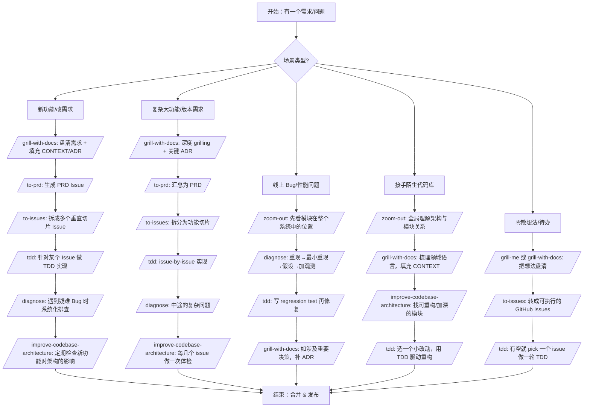

```mermaid
flowchart TD

A[开始：有一个需求/问题] --> B{场景类型?}

B --> B1[新功能/改需求]
B --> B2[复杂大功能/版本需求]
B --> B3[线上 Bug/性能问题]
B --> B4[接手陌生代码库]
B --> B5[零散想法/待办]

%% 新功能
B1 --> C1[/grill-with-docs: 盘清需求 + 填充 CONTEXT/ADR/]
C1 --> D1[/to-prd: 生成 PRD Issue/]
D1 --> E1[/to-issues: 拆成多个垂直切片 Issue/]
E1 --> F1[/tdd: 针对某个 Issue 做 TDD 实现/]
F1 --> G1[/diagnose: 遇到疑难 Bug 时系统化排查/]
G1 --> H1[/improve-codebase-architecture: 定期检查新功能对架构的影响/]
H1 --> Z[结束：合并 & 发布]

%% 大功能
B2 --> C2[/grill-with-docs: 深度 grilling + 关键 ADR/]
C2 --> D2[/to-prd: 汇总为 PRD/]
D2 --> E2[/to-issues: 拆分为功能切片/]
E2 --> F2[/tdd: issue-by-issue 实现/]
F2 --> G2[/diagnose: 中途的复杂问题/]
G2 --> H2[/improve-codebase-architecture: 每几个 issue 做一次体检/]
H2 --> Z

%% 线上 bug
B3 --> C3[/zoom-out: 先看模块在整个系统中的位置/]
C3 --> D3[/diagnose: 重现→最小重现→假设→加观测/]
D3 --> E3[/tdd: 写 regression test 再修复/]
E3 --> F3[/grill-with-docs: 如涉及重要决策，补 ADR/]
F3 --> Z

%% 接手老项目
B4 --> C4[/zoom-out: 全局理解架构与模块关系/]
C4 --> D4[/grill-with-docs: 梳理领域语言，填充 CONTEXT/]
D4 --> E4[/improve-codebase-architecture: 找可重构/加深的模块/]
E4 --> F4[/tdd: 选一个小改动，用 TDD 驱动重构/]
F4 --> Z

%% 零散想法
B5 --> C5[/grill-me 或 grill-with-docs: 把想法盘清/]
C5 --> D5[/to-issues: 转成可执行的 GitHub Issues/]
D5 --> E5[/tdd: 有空就 pick 一个 issue 做一轮 TDD/]
E5 --> Z
```